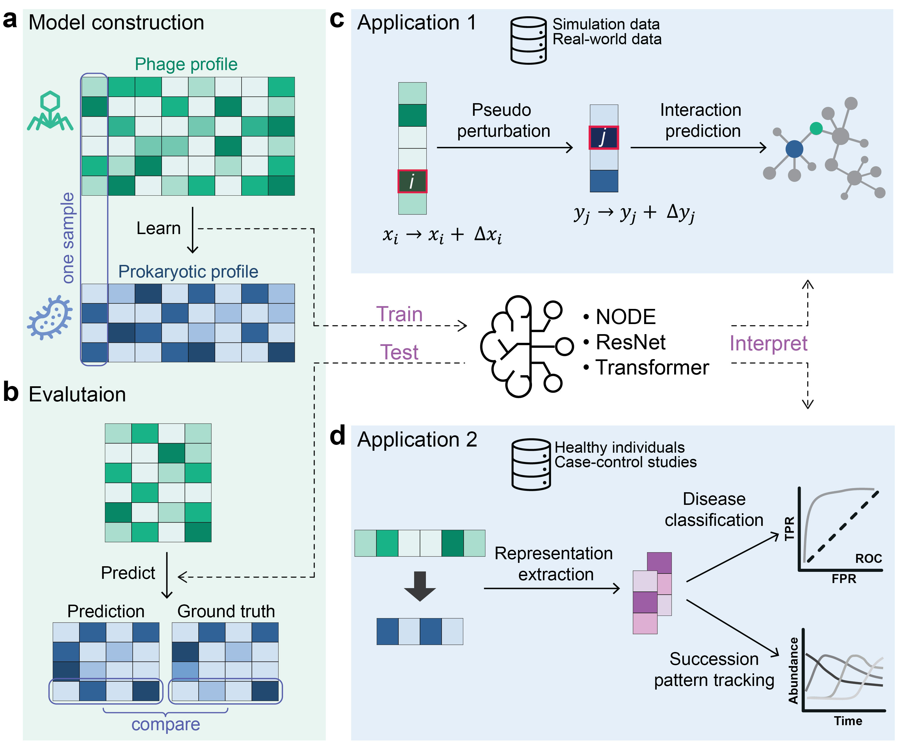

# PHILM: Phage-Host Interaction Learning from Metagenomic profiles

## Overview

**PHILM** is a deep learning framework designed to predict phage-host interactions (PHIs) directly from metagenomic profiles and classify sample status using model-derived latent representations.

**Workflow**



## Table of Contents

- [PHILM: Phage-Host Interaction Learning from Metagenomic profiles](#philm-phage-host-interaction-learning-from-metagenomic-profiles)
  - [Overview](#overview)
  - [Table of Contents](#table-of-contents)
  - [Installation](#installation)
    - [Clone the Repository](#clone-the-repository)
    - [Option 1. Install using conda environment files](#option-1-install-using-conda-environment-files)
    - [Option 2. Install using pip inside a conda environment](#option-2-install-using-pip-inside-a-conda-environment)
  - [Usage](#usage)
    - [Available Commands](#available-commands)
    - [1. Data Preparation](#1-data-preparation)
    - [2. Model Training](#2-model-training)
    - [3. Evaluation](#3-evaluation)
    - [4. Interaction Prediction](#4-interaction-prediction)
    - [5. Permutation-Based p-Value Estimation for Interactions (Optional)](#5-permutation-based-p-value-estimation-for-interactions-optional)
    - [6. Latent Representation Extraction (Optional)](#6-latent-representation-extraction-optional)
  - [Dependencies](#dependencies)
  - [License](#license)
  - [Citation](#citation)

## Installation

### Clone the Repository

```bash
git clone git@github.com:YiyanYang0728/PHILM.git
cd PHILM
```

### Option 1. Install using conda environment files

For NVIDIA GPU systems with CUDA 12.1-compatible drivers:

```bash
conda env create -f env/environment.yml
conda activate PHILM
```

Alternatively, for CPU-only systems:

```bash
conda env create -f env/environment.cpu.yml
conda activate PHILM-cpu
```
If preferred, `mamba` can be used instead of `conda` in the commands above.

### Option 2. Install using pip inside a conda environment

Create a clean conda environment:

```bash
conda create -n PHILM python=3.12
conda activate PHILM
pip install philm
```

Install dependencies for NVIDIA GPU systems with CUDA 12.1-compatible drivers:

```bash
pip install -r env/requirements.gpu-cu121.txt
```

Alternatively, install dependencies for CPU-only systems:

```bash
pip install -r env/requirements.cpu.txt
```

PHILM can run on CPU-only Linux systems and NVIDIA CUDA-enabled Linux systems. Separate requirement files are provided because PyTorch uses different installation packages for CUDA-enabled and CPU-only environments.

> 🍎 **macOS Support:** A macOS-compatible version of PHILM is now available in a separate branch: [PHILM macOS version](https://github.com/YiyanYang0728/PHILM/tree/macos).

## Usage

After installation, PHILM provides several command-line tools for data preparation, model training, evaluation, interaction inference, permutation-based significance testing, and latent representation extraction.

### Available Commands

| Command             | Purpose                                                                                             |
| ------------------- | --------------------------------------------------------------------------------------------------- |
| `philm-split`       | Split paired prokaryotic and phage abundance profiles into training, validation, and test datasets. |
| `philm-train`       | Train a PHILM model using a YAML configuration file.                                                |
| `philm-test`        | Evaluate a trained PHILM model and generate prediction results.                                     |
| `philm-summarize`   | Summarize prediction performance metrics from PHILM output files.                                   |
| `philm-interaction` | Infer phage-prokaryote interaction scores from a trained PHILM model.                               |
| `philm-permutate`   | (Optional) Train PHILM models on permuted datasets for null-model construction.                     |
| `philm-perm-pval`   | (Optional) Calculate empirical p-values and adjusted p-values from permutation-based null results.  |
| `philm-repr`        | (Optional) Extract PHILM-derived latent representations from a trained model.                       |

You can view the help message for each command using `-h` or `--help`.

### 1. Data Preparation

Prepare three inputs for `scripts/split_data.py`: a prokaryotic relative abundance profile, a phage relative abundance profile, and an output directory.
Cross-kingdom relative abundance profiles, including prokaryotes and phages, can be generated using tools such as [sylph](https://github.com/bluenote-1577/sylph) and [phanta](https://github.com/bhattlab/phanta).

```bash
mkdir -p raw_data
wget -t 3 -O raw_data/example.zip https://zenodo.org/records/21252847/files/example.zip
unzip -j raw_data/example.zip -d raw_data
rm raw_data/example.zip
```

Split data into training, validation and test datasets

```bash
philm-split --bact-arc raw_data/Bact_arc_profile.tsv --phage raw_data/Phage_profile.tsv --outdir data
```

**Outputs:**

* Raw split data without normalization:
  `data/<Phage/Bact_arc>_<train/validation/test>_no_clr.tsv`

* Normalized split data:
  `data/<Phage/Bact_arc>_<train/validation/test>.tsv`

* Feature names:
  `data/<Phage/Bact_arc>_feature_names.txt`

* Sample names:
  `data/<train/validation/test>_samples.txt`

### 2. Model Training

Configure training parameters and file paths in a YAML file.

```bash
# Copy the template configuration file and customize it
cp src/philm/config/config_train.yaml my_config_train.yaml

# Run model training
philm-train -c my_config_train.yaml
```

Real-time training progress, checkpoints, and logs are saved in `checkpoints/`.

**Outputs:**

* Best model:
  `results/PHILM_best_model.pth`

* Best parameters:
  `results/PHILM_best_params.yaml`

* Checkpoints and logs:
  `checkpoints/`

### 3. Evaluation

Generate predictions for the test data.

```bash
# Prepare the evalutaion configuration file by merging the best parameters
awk '{print "  "$0}' results/PHILM_best_params.yaml \
    | cat src/philm/config/config_test.yaml - \
    > my_config_test.yaml
# Run evalutaion on test dataset
philm-evaluate -c my_config_test.yaml
# Summarize metrics
philm-summarize results/PHILM_predict_test &> results/PHILM_predict_test.ft.metrics
```

> **Tip:** Repeat the steps above for the validation and training sets by using `config_test.val.yaml` and `config_test.train.yaml`, respectively.

```bash
# Run evalutaion on validation dataset
awk '{print "  "$0}' results/PHILM_best_params.yaml \
    | cat src/philm/config/config_test.val.yaml - \
    > my_config_test.val.yaml
philm-evaluate -c my_config_test.val.yaml
philm-summarize results/PHILM_predict_val &> results/PHILM_predict_val.ft.metrics
# Run evalutaion on training dataset
awk '{print "  "$0}' results/PHILM_best_params.yaml \
    | cat src/philm/config/config_test.train.yaml - \
    > my_config_test.train.yaml
philm-evaluate -c my_config_test.train.yaml
philm-summarize results/PHILM_predict_train &> results/PHILM_predict_train.ft.metrics
```

### 4. Interaction Prediction

Infer host-sensitivity scores for each phage-prokaryote feature pair.

```bash
# Infer interactions on the training dataset
# Note: my_config_test.train.yaml must already exist
philm-interaction -c my_config_test.train.yaml --data-dir data --split train \
    --score-mode gradient --phage-normalize signed_zscore \
    --out results/PHILM_interactions.tsv
```

Optionally, interactions can be inferred using the combined training, validation, and test datasets. This result is expected to be similar to the training-set-based result.

```bash
philm-interaction -c my_config_test.train.yaml --data-dir data --split all \
    --score-mode gradient --phage-normalize signed_zscore \
    --out results/PHILM_interactions.all.tsv
```

**Output:**

* Predicted interaction scores:
  `results/PHILM_interactions.tsv`

### 5. Permutation-Based p-Value Estimation for Interactions (Optional)

This optional step estimates empirical p-values and adjusted p-values for PHILM-inferred interactions using permutation-based null models.

This step is computationally intensive and is recommended only when formal false discovery rate control is required. It is best suited for high-performance computing environments or systems with sufficient CPU resources. For exploratory analyses, users may first apply a heuristic cutoff, such as `normalized_score >= 3.5`, to prioritize candidate PHIs.

```bash
# Step 1: Retrain models using permuted data

cat src/philm/config/config_train_perm.yaml \
    <(awk '{print "  "$0}' results/PHILM_best_params.yaml) \
    > train_perm.yaml
N=99
# Use N=999 for a larger permutation null when computational resources allow.
seq 0 $N \
    | awk '{print "philm-permutate -c train_perm.yaml --perm-id "$1}' \
    > jobs.1.txt
# Run the commands in jobs.1.txt in parallel or submit them as multiple jobs on an HPC cluster.
# while IFS= read -r cmd
# do
#   eval "$cmd"
# done < jobs.1.txt
```

```bash
# Step 2: Infer PHIs from permutation-trained models

mkdir -p permutation_infer_configs

for i in $(seq -f "%03g" 0 $N); do
cat > permutation_infer_configs/config_infer_gradient.perm_${i}.yaml <<EOF
data:
  train_X: data/Phage_train.tsv
  train_Y: data/Bact_arc_train.tsv
  val_X: data/Phage_val.tsv
  val_Y: data/Bact_arc_val.tsv
  test_X: data/Phage_test.tsv
  test_Y: data/Bact_arc_test.tsv

model:
  path: results/permutation_null/perm_${i}/PHILM_perm_${i}.pth
  batch_size: 512
EOF

awk '$0~/hidden_size/{print "  "$0}' results/PHILM_best_params.yaml \
    >> permutation_infer_configs/config_infer_gradient.perm_${i}.yaml
done
```

```bash
> jobs.2.txt
for f in permutation_infer_configs/config_infer_gradient.perm_*.yaml; do
    i=$(basename "$f" .yaml | cut -f2 -d. | cut -f2 -d_)

    echo "philm-interaction \
        -c permutation_infer_configs/config_infer_gradient.perm_${i}.yaml \
        --data-dir data \
        --split train \
        --score-mode gradient \
        --sort-by none \
        --phage-normalize signed_zscore \
        --out results/permutation_null/perm_${i}/PHILM_perm_${i}.raw_gradient.tsv" \
        >> jobs.2.txt
done

# Run the commands in jobs.2.txt in parallel or submit them as multiple jobs on an HPC cluster.
# while IFS= read -r cmd
# do
#   eval "$cmd"
# done < jobs.2.txt
```

```bash
# Step 3: Calculate empirical p-values and adjusted p-values

philm-pval --norm_mode off \
    --observed results/PHILM_interactions.tsv \
    --perm_glob "results/permutation_null/perm_*/PHILM_perm_*.raw_gradient.tsv" \
    --out results/PHILM_interactions.pvalues.tsv
```

Filter significant interactions by adjusted p-value.

```bash
awk -F"\t" 'NR==1 || $5<0.05' \
    results/PHILM_interactions.pvalues.tsv \
    | cut -f1,2,3,5 \
    > results/PHILM_interactions.pvalues.filtered.tsv
```

### 6. Latent Representation Extraction (Optional)

PHILM can extract sample-level latent representations from a trained model. These representations can be used for downstream analyses such as sample classification, clustering, and visualization.

```bash
# Determine the output dimension
outdim=$(wc -l < data/Bact_arc_feature_names.txt)

# Prepare the representation extraction configuration file
awk '{print "  "$0}' results/PHILM_best_params.yaml \
    | cat src/philm/config/config_repr.train.yaml - \
    > my_config_repr.train.yaml
sed -i "s|#OUTDIM#|$outdim|g" my_config_repr.train.yaml
# Extract representations for the training data
philm-repr -c my_config_repr.train.yaml
```

> **Tip:** Apply the same process for the validation and test datasets by using `config_repr.val.yaml` and `config_repr.test.yaml`.

```bash
awk '{print "  "$0}' results/PHILM_best_params.yaml \
    | cat src/philm/config/config_repr.val.yaml - \
    > my_config_repr.val.yaml
sed -i "s|#OUTDIM#|$outdim|g" my_config_repr.val.yaml
philm-repr -c my_config_repr.val.yaml
```

```bash
awk '{print "  "$0}' results/PHILM_best_params.yaml \
    | cat src/philm/config/config_repr.test.yaml - \
    > my_config_repr.test.yaml
sed -i "s|#OUTDIM#|$outdim|g" my_config_repr.test.yaml
philm-repr -c my_config_repr.test.yaml
```

Merge representations across splits.

```bash
cat results/PHILM_train_repr1.tsv \
    results/PHILM_val_repr1.tsv \
    results/PHILM_test_repr1.tsv \
    > results/repr1_all.tsv

cat results/PHILM_train_repr2.tsv \
    results/PHILM_val_repr2.tsv \
    results/PHILM_test_repr2.tsv \
    > results/repr2_all.tsv
```

The `repr1_all.tsv` and `repr2_all.tsv` files are tab-separated files without row names or column names. The number of columns corresponds to the dimensionality of the PHILM-derived representations. Samples are organized as rows and are ordered consistently with `data/train_samples.txt`, `data/val_samples.txt`, and `data/test_samples.txt`.

## Dependencies

PHILM requires the following major Python packages:

* PyTorch
* torchdiffeq
* NumPy
* pandas
* SciPy
* scikit-learn
* scikit-bio
* PyYAML
* Optuna

Please see the requirement files in `env/` for the full dependency lists.

## License

This project is released under the [MIT License](./LICENSE).

## Citation

Please cite PHILM as follows:

Yang, Y., Wang, T., Huang, D., Wang, X. W., Weiss, S. T., Korzenik, J., & Liu, Y. Y. (2025). *Deep Learning Transforms Phage-Host Interaction Discovery from Metagenomic Data*. bioRxiv.

